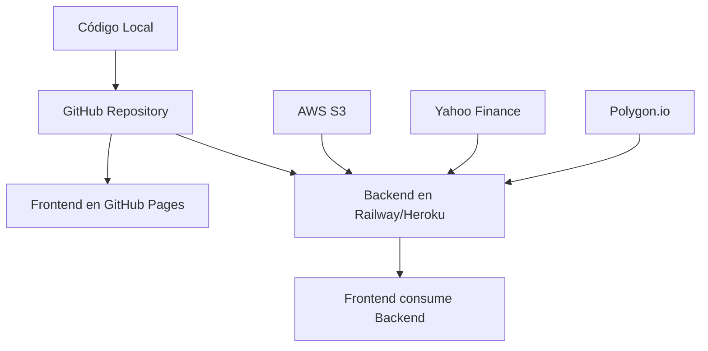

# 🚀 Guía Completa de Configuración y Despliegue

## 📋 Resumen del Flujo de Despliegue



## 🏗️ Arquitectura de Despliegue

### Frontend (GitHub Pages)
- **URL**: `https://tuusuario.github.io/sp500-predictor`
- **Funciona**: Con datos mock si backend no disponible
- **Variables**: Solo `VITE_API_URL` y `VITE_POLYGON_API_KEY`

### Backend (Railway/Heroku/DigitalOcean)
- **URL**: `https://tu-backend.railway.app`
- **Funciona**: Con datos reales de Yahoo Finance + modelo XGBoost
- **Variables**: AWS credentials, Polygon API key

---

## 🔧 Configuración Paso a Paso

### 1. ✅ YA HECHO - Subir a GitHub
```bash
# Ya ejecutaste esto:
git add .
git commit -m "feat: Initial commit - SP500 Predictor Dashboard"
git push -u origin main
```

### 2. 🎯 Desplegar Backend (Railway - Recomendado)

#### A. Crear cuenta en Railway
1. Ve a https://railway.app
2. Regístrate con GitHub
3. Click "New Project" → "Deploy from GitHub repo"
4. Selecciona tu repositorio `sp500-predictor`
5. Configura:
   - **Root Directory**: `backend`
   - **Build Command**: `pip install -r requirements.txt`
   - **Start Command**: `python main.py`

#### B. Configurar Variables de Entorno en Railway
En el dashboard de Railway → Settings → Variables:
```env
AWS_ACCESS_KEY_ID=tu_clave_aws_real
AWS_SECRET_ACCESS_KEY=tu_secret_aws_real
S3_BUCKET_NAME=tu_bucket_s3
S3_MODEL_KEY=ruta/al/modelo.pkl
POLYGON_API_KEY=tu_clave_polygon_real
PORT=8000
DEBUG=false
```

#### C. Obtener URL del Backend
Railway te dará una URL como: `https://sp500-predictor-production.up.railway.app`

### 3. 🌍 Configurar Frontend para Producción

#### A. Crear archivo `.env.production.local`
```env
VITE_API_URL=https://sp500-predictor-production.up.railway.app
VITE_POLYGON_API_KEY=tu_clave_polygon_real
```

#### B. Configurar Secrets en GitHub
Ve a tu repositorio → Settings → Secrets and variables → Actions:
- `VITE_API_URL`: `https://sp500-predictor-production.up.railway.app`
- `VITE_POLYGON_API_KEY`: `tu_clave_polygon_real`

### 4. 🚀 Desplegar Frontend en GitHub Pages

#### A. Configurar GitHub Pages
1. Ve a tu repositorio → Settings → Pages
2. Source: "Deploy from a branch"
3. Branch: `gh-pages` (se creará automáticamente)
4. Folder: `/ (root)`

#### B. Desplegar
```bash
npm run deploy
```

---

## 🔑 Obtener API Keys y Credenciales

### AWS (Para modelo XGBoost)
1. **Crear cuenta AWS**: https://aws.amazon.com
2. **IAM Console**: Crear usuario con permisos S3
3. **Crear bucket S3**: Para almacenar el modelo
4. **Subir modelo**: `xgboost_sp500_model.pkl` a S3
5. **Obtener credenciales**: Access Key ID y Secret Access Key

### Polygon.io (Para noticias - Opcional)
1. **Crear cuenta**: https://polygon.io
2. **Plan Free**: 5 calls/minuto gratis
3. **Obtener API Key**: En dashboard → API Keys

---

## 🎯 Configuración Específica por Servicio

### Opción 1: Railway (Recomendado)
```bash
# 1. Conectar GitHub
# 2. Seleccionar repositorio
# 3. Configurar:
Root Directory: backend
Build Command: pip install -r requirements.txt
Start Command: python main.py

# 4. Variables de entorno (en Railway dashboard):
AWS_ACCESS_KEY_ID=tu_clave_real
AWS_SECRET_ACCESS_KEY=tu_secret_real
S3_BUCKET_NAME=tu_bucket
S3_MODEL_KEY=modelo.pkl
POLYGON_API_KEY=tu_clave_polygon
PORT=8000
DEBUG=false
```

### Opción 2: Heroku
```bash
# Instalar Heroku CLI
heroku create sp500-predictor-backend

# Configurar variables
heroku config:set AWS_ACCESS_KEY_ID=tu_clave_real
heroku config:set AWS_SECRET_ACCESS_KEY=tu_secret_real
heroku config:set S3_BUCKET_NAME=tu_bucket
heroku config:set S3_MODEL_KEY=modelo.pkl
heroku config:set POLYGON_API_KEY=tu_clave_polygon
heroku config:set PORT=8000
heroku config:set DEBUG=false

# Desplegar
git subtree push --prefix backend heroku main
```

### Opción 3: DigitalOcean App Platform
1. **Crear cuenta**: https://cloud.digitalocean.com
2. **Apps → Create App**
3. **Conectar GitHub**: Seleccionar repositorio
4. **Configurar**:
   - Source Directory: `backend`
   - Build Command: `pip install -r requirements.txt`
   - Run Command: `python main.py`
5. **Variables**: Añadir todas las variables de AWS y Polygon

---

## 🔄 Flujo de Actualización

### Para actualizar el código:
```bash
# 1. Hacer cambios en el código
git add .
git commit -m "feat: nueva funcionalidad"
git push origin main

# 2. Backend se actualiza automáticamente en Railway
# 3. Frontend se actualiza automáticamente via GitHub Actions
```

### Para cambiar configuración:
```bash
# 1. Actualizar variables en Railway dashboard
# 2. Actualizar Secrets en GitHub
# 3. Re-desplegar frontend si es necesario:
npm run deploy
```

---

## 🧪 Verificar Funcionamiento

### Checklist de Verificación:
1. **✅ Backend funcionando**: 
   - `https://tu-backend.railway.app/health` → `{"status": "healthy"}`
   - `https://tu-backend.railway.app/api/market/current` → Datos del S&P 500

2. **✅ Frontend funcionando**:
   - `https://tuusuario.github.io/sp500-predictor` → Dashboard carga
   - Datos reales se muestran (no mock)
   - Predicciones XGBoost funcionan

3. **✅ Integración completa**:
   - Análisis técnico con datos reales
   - Sentimiento de noticias funciona
   - Gráficos se actualizan correctamente

---

## 🚨 Troubleshooting

### Backend no responde:
```bash
# Verificar logs en Railway
# Verificar variables de entorno
# Verificar credenciales AWS
```

### Frontend no carga datos:
```bash
# Verificar VITE_API_URL en GitHub Secrets
# Verificar CORS en backend
# Verificar que backend esté funcionando
```

### Modelo XGBoost no carga:
```bash
# Verificar que el archivo existe en S3
# Verificar permisos AWS
# Verificar formato del modelo (.pkl)
```

---

## 💰 Costos Estimados

### Servicios Gratuitos:
- **GitHub Pages**: ✅ Gratis
- **Railway**: ✅ $5/mes + usage
- **AWS S3**: ~$0.023/GB/mes
- **Polygon.io**: ✅ 5 calls/min gratis

### Estimación mensual: **$5-10** para proyecto completo

---

## 🎉 Resultado Final

### URLs Finales:
- **Dashboard**: `https://tuusuario.github.io/sp500-predictor`
- **Backend API**: `https://tu-backend.railway.app`
- **Repositorio**: `https://github.com/tuusuario/sp500-predictor`

### Funcionalidades:
- ✅ Predicciones ML en tiempo real
- ✅ Análisis técnico con 20+ indicadores
- ✅ Sentimiento de noticias
- ✅ Datos reales del S&P 500
- ✅ UI profesional responsive
- ✅ Deploy automático

¡Tu SP500 Predictor estará funcionando 24/7 en internet! 🚀
